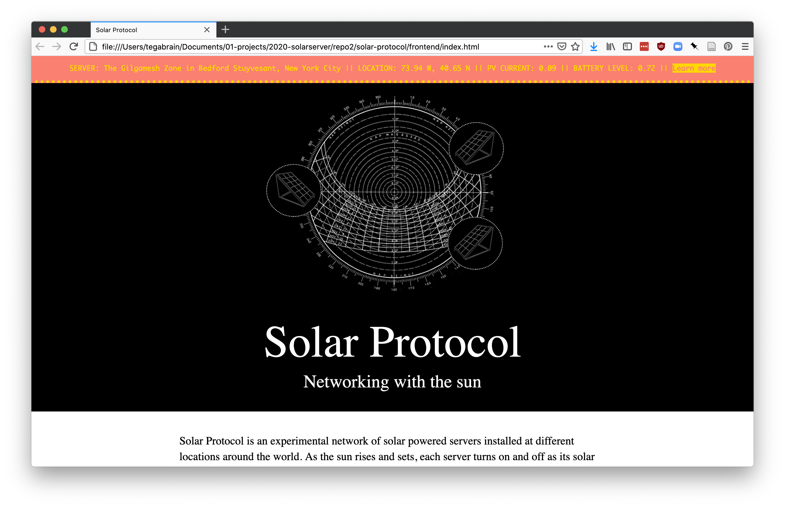
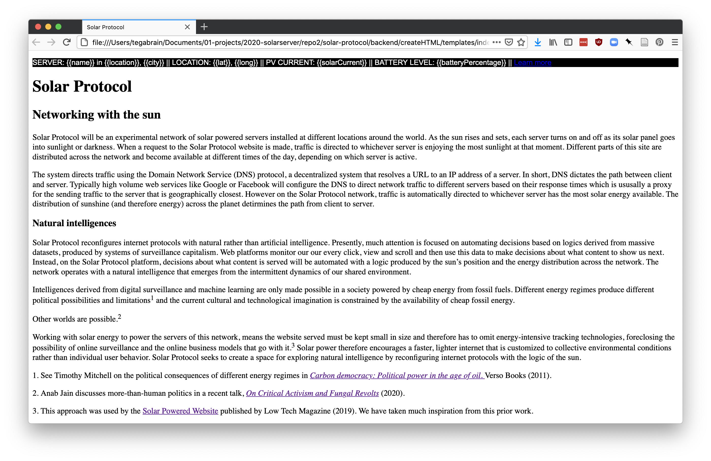

# Solar Protocol  

#### *Networking with the sun*  
  
Solar Protocol is an experimental network of solar powered servers installed at different locations around the world. As the sun rises and sets, each server turns on and off as its solar panel goes into sunlight or darkness. The network hosts the Solar Protocol website and when a request to this site, traffic is directed to whichever server is enjoying the most sunlight at that moment. Different parts of this site are distributed across the network and become available at different times of the day, depending on which server is active.  
  
The system directs traffic using the Domain Network Service (DNS) protocol, a decentralized system that resolves a URL to an IP address of a server. In short, DNS dictates the path between client and server. Typically high volume web services like Google or Facebook will configure the DNS to direct network traffic to different servers based on their response times which is ususally a proxy for the sending traffic to the server that is geographically closest. However on the Solar Protocol network, traffic is automatically directed to whichever server has the most solar energy available. The distribution of sunshine (and therefore energy) across the planet detirmines the path from client to server.   
  
### Natural intelligences  
  
Solar Protocol reconfigures internet protocols with natural rather than artificial intelligence. Presently, much attention is focused on automating decisions based on logics derived from massive datasets, produced by systems of surveillance capitalism. Web platforms monitor our our every click, view and scroll and then use this data to make decisions about what content to show us next. Instead, on the Solar Protocol platform, decisions about what content is served will be automated with a logic produced by the sun’s position and the energy distribution across the network. The network operates with a natural intelligence that emerges from the intermittent dynamics of our shared environment.  
  
Intelligences derived from digital surveillance and machine learning are only made possible in a society powered by cheap energy from fossil fuels. Different energy regimes produce different political possibilities and limitations1 and the current cultural and technological imagination is constrained by the availability of cheap fossil energy.  
  
Other worlds are possible.2  
  
Working with solar energy to power the servers of this network, means the website served must be kept small in size and therefore has to omit energy-intensive tracking technologies, foreclosing the possibility of online surveillance and the online business models that go with it.3 Solar power therefore encourages a faster, lighter internet that is customized to collective environmental conditions rather than individual user behavior. Solar Protocol seeks to create a space for exploring natural intelligence by reconfiguring internet protocols with the logic of the sun.  
  
1. See Timothy Mitchell on the political consequences of different energy regimes in Carbon democracy: Political power in the age of oil. Verso Books (2011).  
  
2. Anab Jain discusses more-than-human politics in a recent talk, On Critical Activism and Fungal Revolts (2020).  
  
3. This approach was used by the Solar Powered Website published by Low Tech Magazine (2019). We have taken much inspiration from this prior work.  

### Get Involved   
#### Call for Server Stewards  
  
Are you interested in stewarding a server as part of Solar Protocol? A server steward is someone who can host and care for a solar server and who is interested in being a guest collaborator on our project.**  
  
We're currently looking for people or organizations in different locations around the world who can host one of our servers for at least a year and who are also interested in contributing their domain expertise to help us explore this network together. We are aiming to establish a server on every continent in the world (except perhaps for Antarctica).  
  
Ideally, a server steward would have a basic understanding of programming (specifically with Raspberry Pi/ Linux) and IT infrastructure to assist us with troubleshooting the installation. However, we are also able to bring on a few collaborators with less experience and who can offer different perspectives on the project. At this point there is opportunity for both institutional collaborators like arts venues and universities that might be able fund their own participation as well as individuals or collectives without these resources. If you fall into the latter group, we have a budget to cover expenses for DIY/independent collaborators. Server stewards should demonstrate a willingness to build community and share materials and resources through teaching and learning.  
  
If you have a sunny rooftop and are interested in experimenting with us, please read the questions and answers below and fill out this brief [expression of interest form.](https://airtable.com/shrwTVfy9TAvg5oHk)
##### *What are the technical/physical requirements for a server location?*. 
  
* A safe and accessible outdoor area that is exposed to direct sunlight for at least 4 hours per day (this means a spot that is free from obstructions/shadows and ideally facing the equator)  
* You need to be able to secure the solar panel to a wall, pole or rooftop so it doesn't blow away or get stolen  
* The server needs Internet access either via ethernet cable or wifi (minimum network speed: 25mb/s up & 25mb/s down)  
* You need to be able to set up port forwarding for both http (port 80) and ssh (port 20) with your Internet Service Provider to serve the solar protocol network publically  

##### *What is the timeline of this project?*

We are looking to set up servers with stewards in the first 3 months of 2021. We ask you to steward and care for your server for a minimum of 12 months.
##### *Do I need to speak English?*  
  
Unfortunately our team only speaks English and Italian. We’d be happy to try to find a translator and we would also be interested in translating the project into the language spoken by server stewards.  
Keep in touch

If you have further questions, you can email us here. Or to get a very occasional update about this project, please consider joining our TinyLetter here.

*Thanks to Taeyoon Choi and collaborators on the Distributed Web of Care project for their work on stewardship, care and the internet.
### Research in Progress  

* This project is still in development. This work and code is open-source and shared on Github.  
* A project research archive can be found on [this channel.](https://www.are.na/tega-brain/solar-powered-media)  

### Attribution
  
This is work in progress by [Tega Brain](http://tegabrain.com/), [Alex Nathanson](http://www.alexnathanson.com/about.html) and [Benedetta Piantella](https://engineering.nyu.edu/faculty/benedetta-piantella). It is a part of the [Eyebeam Rapid Response for a Better Digital Future program.](https://www.eyebeam.org/rapidresponse/) 

### Project Images

*Solar Protocol website (high resolution version displayed when the server battery is charged):*

*Solar Protocol website (low resolution version displayed when the server battery is running low):*

*Routing logic of the network is determined by sun position:*. 

*Prototype servers in Brooklyn:*

